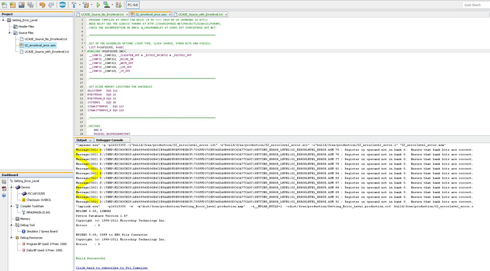

# Error Message

There is a need to set ERRORlevel in the UI.  This very simple example shows the issue.  When the program is larger the messages[] are a huge distraction.
Simply need some method of adding to the project configuration the switches.

See project https://mplabxpress.microchip.com/mplabcloud/ide/import/0f6517dd-6307-41f7-9d3d-c9b740619926?code=f499e9168cab8de3c30433b85950a1df4c60c909

