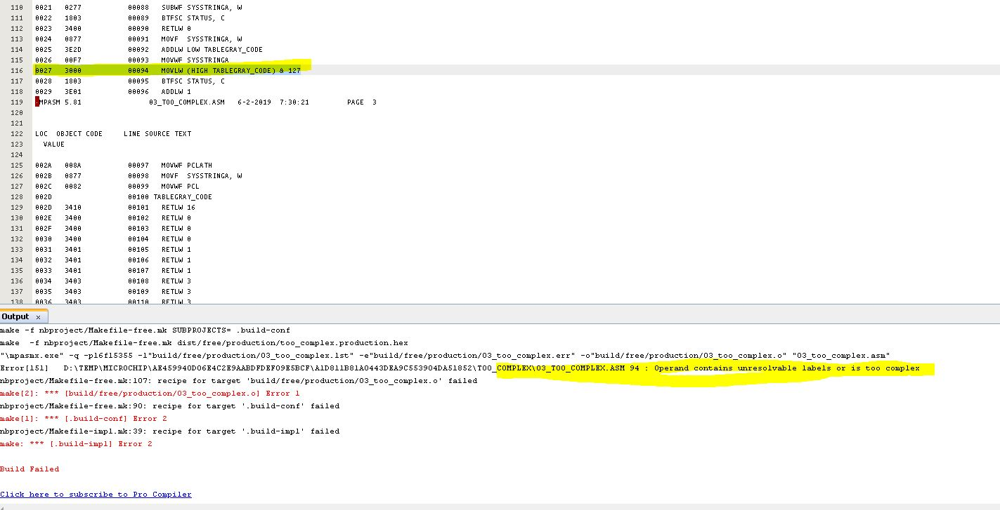

# Error Message

This is a tad more complex....

The source ASM fails to compile with the following error:

    Error[151]   D:\TEMP\MICROCHIP\AE459940D06E4C2E9AABDFDEF09E5BCF\A1D811B81A0443DEA9C553904DA51852\TOO_COMPLEX\03_TOO_COMPLEX.ASM 94 : Operand contains unresolvable labels or is too complex

However, the same ASM compile correctly using MPASMX,  see the file LST_FROM_MPASM.txt for the outout from MPASM 5.81.

I am not sure what is going on... but, the ASM does operate correctly on a real MCU.

Is this too complex or a label issue?

Notes:

I have added errorlevel -302 to mask the 302 messages

See project https://mplabxpress.microchip.com/mplabcloud/ide/import/6f107c57-c3c4-411e-8d90-024c24e5869a?code=5a2c1bcf87b40debfc4518613ac496a7c95788fb

