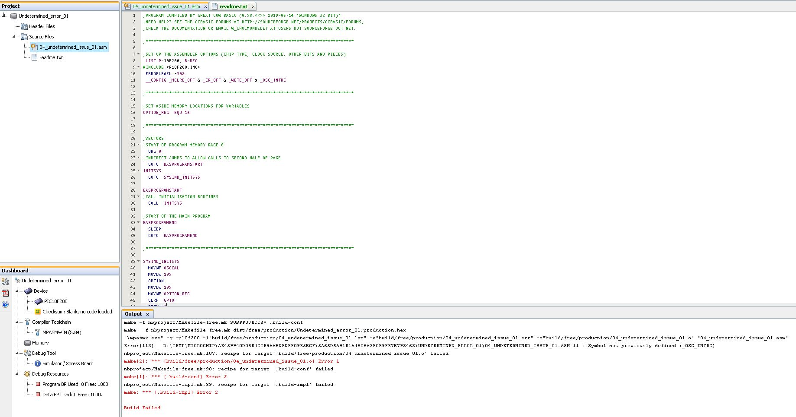

# Error Message

This is probably... case sensitivity but I am not sure.

In the source INC file config 1... is OSC_IntRC.... NOTE the case.

So, unless the user gets the case 100% they will not be able to compile.

See project https://mplabxpress.microchip.com/mplabcloud/ide/import/d4d9c55c-1d86-4b65-9e42-ff24110c9c0b?code=3ccde07946dba47419b7dac3d396c6f5b0f694e4

