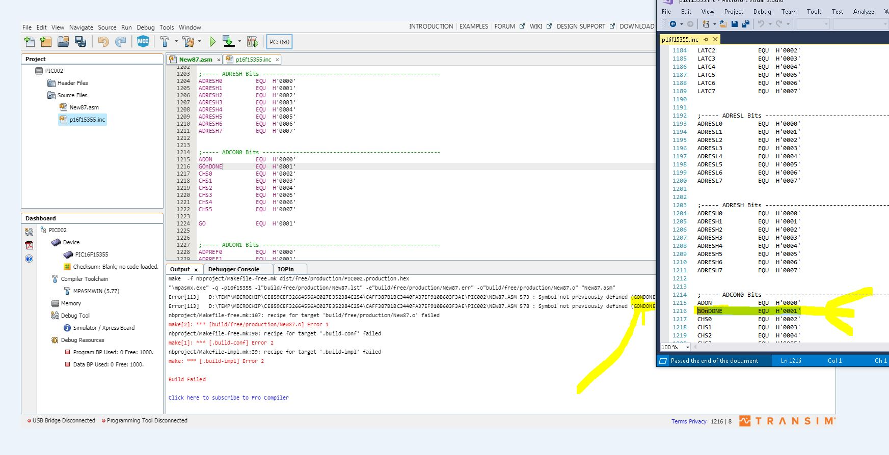

# Error Message

This is case sensitivity again, but, I only figured this out when documenting these issues.

In the source INC file ADCON0 register is GOnDONE.... NOTE the case.

So, again, unless the user gets the case 100% they will not be able to compile.

We need a switch to support case sensitivity.

No project for this... not needed just a picture.

